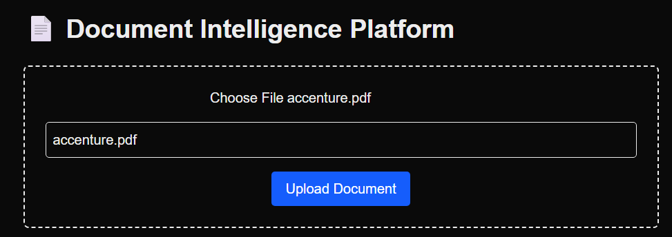
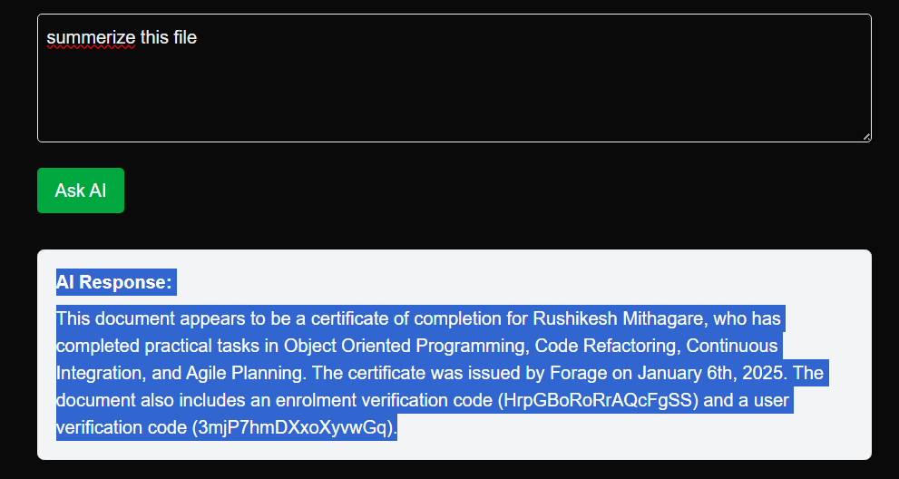

# 📄 Document Intelligence Platform

A full-stack Retrieval-Augmented Generation (RAG) system that allows users to upload documents, store them locally, extract embeddings into ChromaDB, and query content using OpenAI/LLM. Built using Django, MySQL, ChromaDB, and ReactJS with Tailwind CSS.

---

## 🔍 Description

A RAG-based document QA system that enables users to upload PDFs or text files, automatically parse and embed content, store vectors using ChromaDB, and query using LLMs (OpenAI or LM Studio). Ideal for exploring unstructured document data with AI-powered answers.

---

## 🖼️ Screenshots

### Upload Document Page  


### Chat with Document Page  


---

## 🧰 Tech Stack

### 📦 Backend:
- Python 3.10+
- Django 4.2+
- Django REST Framework
- MySQL (for metadata)
- ChromaDB (vector storage)
- LangChain (context builder)
- OpenAI API / LM Studio (LLM)
- PyPDF2, Unstructured (document parser)

### 💻 Frontend:
- ReactJS via Next.js 14
- Tailwind CSS
- Axios (HTTP requests)
- React-Markdown

---

## ⚙️ Setup Instructions

### 🧠 Backend (Django + MySQL + ChromaDB)

```bash
# 1. Clone the repo
git clone https://github.com/vaibhavxom/RAG-Integration-Assignment.git
cd RAG-Integration-Assignment/backend

# 2. Create and activate a virtual environment
python -m venv venv
source venv/bin/activate  # Windows: venv\Scripts\activate

# 3. Install dependencies
pip install -r requirements.txt

# 4. Run DB migrations
python manage.py migrate

# 5. Start the development server
python manage.py runserver
```

---

### 💻 Frontend (ReactJS + Tailwind)

```bash
cd ../frontend/document-ai-frontend

# Install dependencies
npm install

# Start development server
npm run dev
```

---

## 📡 API Documentation

### `POST /documents/upload/`  
- Uploads document and metadata to MySQL  
- Extracts, chunks, and embeds content  
- Stores vectors in ChromaDB  

Payload:
```form-data
file: document.pdf  
title: "My PDF"
```

Response:
```json
{
  "id": 1,
  "title": "My PDF",
  "filename": "document.pdf"
}
```

---

### `POST /documents/ask/`  
- Accepts question and document ID  
- Retrieves matching vectors from ChromaDB  
- Sends context and question to LLM  
- Returns AI-generated answer  

Payload:
```json
{
  "document_id": 1,
  "question": "What is the summary of this document?"
}
```

Response:
```json
{
  "answer": "This document outlines the principles of AI in education..."
}
```

---

## 💬 Sample Questions and Answers

**Q:** What is the key summary of this uploaded document?  
**A:** The document outlines the core principles of machine learning and its application in finance.

**Q:** What does the author say about sustainable energy?  
**A:** The author emphasizes the urgency of transitioning to solar and wind to meet global goals.

---

## 📦 Backend Requirements (`requirements.txt`)

```text
Django>=4.2
djangorestframework
mysqlclient
openai
chromadb
langchain
python-dotenv
PyPDF2
unstructured
tiktoken
```

---

## 📦 Frontend Dependencies (`package.json`)

```json
{
  "dependencies": {
    "axios": "^1.6.7",
    "next": "14.1.0",
    "react": "18.2.0",
    "react-dom": "18.2.0",
    "react-markdown": "^9.0.0",
    "tailwindcss": "^3.4.1"
  }
}
```

Install frontend packages:

```bash
cd frontend/document-ai-frontend
npm install
```

---

## 📁 Sample Documents

Include sample PDFs or text files in a `/sample_docs/` folder to test the upload and vectorization features.

---

